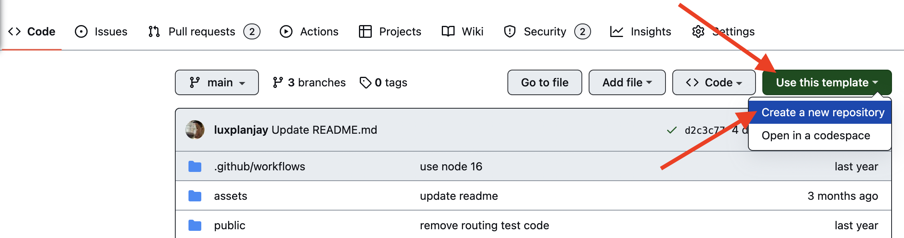

# Event Application

This project was created with
[Create React App](https://github.com/facebook/create-react-app). To get
acquainted and configure additional features
[refer to documentation](https://facebook.github.io/create-react-app/docs/getting-started).

## Creating a repository by template

Use this repository as a template for creating a repository
of your project. To use it just tap the `«Use this template»` button and choose
`«Create a new repository»` option, as you can see on the image below.

The page for creating a new repository will open on the next step. Fill out
the Name field and make sure the repository is public, then click
`«Create repository from template»` button.

You now have a personal project repository, having a repository-template file
and folder structure. After that, you can work with it as you would with any
other private repository: clone it on your computer, write code, commit, and
send it to GitHub.

## Preparing for coding

1. Make sure you have an LTS version of Node.js installed on your computer.
   [Download and install](https://nodejs.org/en/) if needed.
2. Install the project's base dependencies with the `npm install` command.
3. Start development mode by running the `npm start` command.
4. Go to [http://localhost:3000](http://localhost:3000) in your browser. This
   page will automatically reload after saving changes to the project files.
